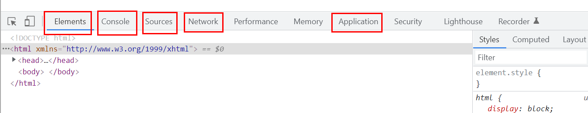
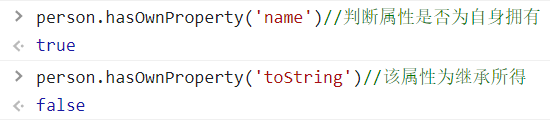

## 1 什么是JS

脚本语言

## 2 快速入门

### 2.1 引入JS

1. 内部标签

   ```html
   <!--script标签内写js-->
   <script>
   	alert('hello world!'); //可以不加分号
   </script>
   ```

2. 外部引入(单独的js文件)

   myjs.js

   ```javascript
   alert('hello world!');
   //js文件里的注释用//引起
   ```

   test.html

   ```html
   <!DOCTYPE html>
   
   <html xmlns="http://www.w3.org/1999/xhtml">
   <head>
       <meta charset="utf-8" />
       <title>Title</title>
       <script src="qj.js"></script>
       <!--注意这里不能用自闭合标签<script src="qj.js"/>，会报错-->
       <!--不用显示定义type<script type = "text/javascript" ……>，也就默认类型-->
   </head>
   <body>
       <!--script也可以放body里-->
   </body>
   </html>
   ```

### 2.2 基本语法

1. 语法

   ```html
   <script>
       //js区分大小写
       //定义变量。js中变量仅var一种
       var num = 1;
       // alert(num);
       //条件控制:分支、循环
       if(2>1){
           alert("1");
       }else if(3>2){
           alert("2");
       }else{
           alert("3");
       }
   </script>
   ```
   
   
   
2. 浏览器控制台使用

   * Elements基本元素
   * Console控制台
     * console.log(var_name) 在浏览器的控制台console打印js中的变量
   * Source可以打断点调试源码

   * Network网络请求返回的东西

   * Application可以存一些数据

   

   

### 2.3 数据类型

数值 文本 图形 音频 视频……

* number：不区分小数和整数

  ```javascript
  //整数 浮点数 科学记数法 复数
  NaN  //not a number
  Infinity  //无穷大
  ```

* 字符串：'aaa', "aaa"

* 布尔值

* 逻辑运算：&&，||，！

* 比较运算：= 赋值，== 等于，=== 绝对等于（类型一样值一样）   

  ==比较相等用三个等号！！！！==

  * 注意

    * NaN≠所有值，包括自己。判断是否为number：isNaN(NaN)

    * 浮点数问题：1/3 != 1-2/3 有精度损失。尽量不用浮点数。

      判断浮点数相等

      ```javascript
      Math.abs(1/3-(1-2/3))<0.000001
      ```

* null空  undefined未定义

* 数组：类型可不相同-----类似python

  > Java中数组对象类型相同------类似c

  ```javascript
  var arr = [1,2,"q",'a',null,true]//推荐
  new Array(1,2,"q")
  ```

  数组下标越界：undefined

* 对象-----类似python字典

  > 数组是[ ]，对象是{ }

  ```javascript
  var person = {
      name:"zgq",
      age:3
  }
  var p = new Person("zgq",3)//创建对象
  p.name//取对象的值
  ```

* 变量----命名：中文√，数字开头×

### 2.4 严格检查模式

* 全局变量---可能覆盖别人写的局部变量

  > 函数内部没有声明的变量自动转全局变量

* var是函数作用域，let是块作用域（比如for循环内定义就只在for内有效，和c的局部变量类似）

  ```js
  <script>  
      a = 1;//全局变量    
      var b = 2;//var定义    
      let i = 0;//ES6中，局部变量建议用let定义，不用var
  </script>
  ```

* 严格检查模式：加'use strict'

  > 注：由于脚本语言逐行编译，因此'use strict'只对它之后的代码有效，因此一般加在开头
  
  ```html
  <script>
      'use strict'
      //此时“i = 1;”会报错   
  	let i = 0;
  </script>
  ```

## 3 数据类型

### 3.1 字符串

> 和python类似

* js不区分字符和字符串

  ```javascript
  console.log("aaa");//输出字符串
  \u4e2d //汉字：中  Unicode字符 \u####
  \x41 //Ascii字符
  ```

* 多行字符串编写-------反引号`

  ```javascript
  var msg = `hello
  world`
  ```

* 字符串模板-----也要用反引号

  ```javascript
  let name = 'zgq'
  let str = `你好，${name}`
  ```

* 字符串属性：长度
* 字符串方法：大小写转换，字符首次出现位置，子串（算头不算尾）
* 不可变性（和python类似。c的字符串可变）

### 3.2 数组

> 类似python的list

* Array可以包含任意数据类型

* 属性

  ```javascript
  arr.length //长度，可变
  arr.length = 4;//赋值改变arr长度，过小丢失数据，过大多出来的位置为undefined
  ```

* 方法

  ```javascript
  indexOf()//返回索引
  slice()//切片
  push();pop();//尾部
  unshift();shift();//头部
  sort();//排序
  reverse();//元素反转
  concat();//拼接，注意没有改变原数组
  join('-');//使用'-'连接各元素
  ```

* 多维数组

### 3.3 对象

> 有点像python的字典

```js
var person = {
    name:"zgq",
    age:3
}
//使用不存在的属性会报错（undefined）
person.name = 'zgqqq' //对象赋值
delete person.name //属性删除
person.job = 'cctv'  //属性添加
'name' in person //判断属性是否在对象中
//js中键都为字符串，值为任意对象
```

* hasOwnProperty()方法



### 3.4 流程控制

* 分支if

* 循环while，do while，for (let i = 0; i < 100; i++)，for...in  取下标，for...of  取值

* 数组循环：forEach(函数) 遍历数组  ---------------------c++也有forEach？？

  ```js
  age.forEach(function (value){
      console.log(value)
  })
  ```

  

### 3.5 Map和Set

> Map类似python的字典，键值对

```js
var map = new Map([['tom',10],['zgq',3]]);
var name = map.get('tom') //用key得value
map.set('ss',123); //添加or修改键值对
map,delete('tom'); //删除键值对
```

> Set()无序不重复集合

```js
var set = new Set([1,2,3,3,3]);//可以去重
set.add(4); //添加
set.delete(1); //删除
console.log(set.has(3)); //判断是否有某元素
```

### 3.6 迭代器iterator

> ES6新特性

for...in取下标，for...of取值----遍历数组、map、set

```js
var arr = [3,4,5];
//arr.name = "123";---会导致for..in遍历时下标出错：1,2,3，name
//但是for..of不会打印“123”
for (var x of arr){
    console.log(x);
} 
[3,4,5,name:"123"]//添加name后的arr。(这时候看着像键值对？)----好像是js一个错误
```

## 4 函数

### 4.1 定义函数

```js
//y = 2*x
//方式1（推荐）
function fun(x){return 2*x;}
//方式2
var fun = function(x){} //后面是一个匿名函数，但是结果传给fun
//两种方式等价
```

js可传任意个参数，但是用的只是前几个定义了的形参。

规避有实参没形参：

```js
if(typeof x !== 'number'){
    throw 'Not a number';//抛出报错
}
```

* arguments参数：是一个数组，表示传进来的所有参数。

* rest参数：一个数组，已定义参数之外的所有参数。

  ```js
  function f(a, b, ...rest){
      console.log("a:"+a);
      console.log("b:"+b);
      console.log(rest);//rest是ES6新出的
  }
  ```

### 4.2 变量作用域

* 变量重名时由内向外找

* js有变量声明提升机制，只提升声明但不提升赋值

  所以要用的变量最好是最开始统一声明(c的规范)----(但是随用随声明是啥？？？

* 全局变量

  全局对象window：默认所有的全局变量绑定到window对象上-----不同js文件命名可能冲突

  alert()函数本身也是一个window变量，可以改变其定义------函数赋值方法2(但是这种方式太随意，不严谨)

  `jQuery`

* 命名空间

  ```js
  //定义命名空间(一个对象)，全局变量定义到自己的命名空间下-----解决不同js文件命名冲突
  var myNamespace = {};
  //定义全局变量
  myNamespace.name = 'zgq';
  myNamespace.add = fun(a, b){
      return a+b;
  }
  ```

* 局部作用域let--------用它不用var

* 常量const

  ES6前定义常量：全大写字母，可以改变但不建议

  ES6后：const定义

#### 4.3 方法

对象有属性，也可以有方法

```js
var person = {
    name:'zgq',
    birth:2017,//属性
    age:function(){//方法
        var now = new Date().getFullYear();
        return now - this.birth;//this表示当前对象
    }
}
```

apply可以控制this指向。

```js
function getAge(){
    var now = new Date().getFullYear();
    return now - this.birth;//this表示当前对象
}
var person = {
    name:'zgq',
    birth:2017,//属性
    age:getAge
}
//person.age()不会报错，但是最好不要这么用
getAge.apply(person, []) //this指向了person，参数为空
```

## 5 内部对象

标准对象：number，string，boolean，object，function

### 5.1 Date

```js
var now = new Date();//Thu Jan 13 2022 23:08:25 GMT+0800 (中国标准时间)
//注意，月份是0~11.
now.getTime()//时间戳，全世界统一
var nowTime = new Date(now.getTime())//时间戳转时间
//转换：to###
```

### 5.2 JSON

* 早期数据传输用XML。

* JSON(JavaScript Object Notation, JS 对象简谱) 是一种轻量级的数据交换格式。

  简洁和清晰的**层次结构**使得 JSON 成为理想的数据交换语言。 

  易于人阅读和编写，同时也易于机器解析和生成，并有效地提升网络传输效率。

* 在js中一切皆对象，js任何类型都可以用JSON表示。

  格式：对象都用{}，数组都用[]，键值对都用key:value

  ```js
  //对象转json字符串
  var a = JSON.stringify(person)//a = '{"name":"zgq","birth":2017,"age":3}'
  //json字符串转对象
  JSON.parse(a)//输出{name: 'zgq', birth: 2017, age: 3}
  
  //这俩函数互逆
  ```

* JSON和js对象的区别

  ```js
  var obj = {a:'hello',b:'world'};
  var json = '{"a":"hello","b":"world"}';
  ```

### 5.3 Ajax

原生的js写法 xhr异步请求

jQuery 封装好的 方法$("#name").ajax("")

axios 请求

## 6 面向对象编程

### 6.1 原型继承

```js
var person = {
    name:'aaa',
    birth:2017,//属性
    age:function(){//方法
        var now = new Date().getFullYear();
        return now - this.birth;//this表示当前对象
    }
}
var zgq = {
    name = 'zgq'
}
zgq.__proto__ = person //zgq的原型是person，类似继承
```

### 6.2 class继承

> class关键字在ES6引入

class类

```js
class person{
    constructor(name){
        this.name = name;
    }
    hello(){
        alert("hello")
    }
}//模板
var zgq = new person("zgq")//对象
zgq.hello()//输出：hello
```

继承-----本质还是原型继承

```js
class student extends person{
    constructor(name,grade){
        super(name);//继承
        this.grade = grade;//自己新增的方法
    }
    getgrade()
    {
        alert(grade)
    }
}
```

* 原型链

  所有对象最终原型为object。其原型是自己。

## 7 操作BOM对象

### 7.1 浏览器介绍

js和浏览器的关系：js诞生就是为了让它在浏览器中运行

B：浏览器，BOM：浏览器对象模型

原生浏览器：IE，Chrome，Safari，Firefox

第三方：360浏览器--------------Chrome的内核

### 7.2 浏览器对象

* window：代表浏览器窗口

```js
window.innerHeight//屏幕内高度
window.outerHeight//屏幕内高度
//宽度同理
```

* Navigator：封装浏览器信息，系统名称、版本等

  ==大多数时候不用，因为可以被人为修改。==

* screen：屏幕属性(高度宽度等)

* location(重要)：当前页面的URL信息

  ```js
  host: "www.baidu.com"
  href: "https://www.baidu.com/"
  protocol: "https:"
  reload: ƒ reload()//刷新网页
  location.assign('https://chrome.google.com/')//设置新地址
  ```

* document：当前页面 HTML DOM文档树

  可以获取所有文档树节点---所以可以修改网页

  ```js
  document.cookie//获取cookie
  //劫持cookie原理：加一段js
  //恶意人员：获取你的cookie上传到它的服务器
  //服务端可以设置cookie为只读
  ```
  
* history：浏览器的历史记录

  ```js
  history.forwrd()
  history.back()
  ```

## 8 操作DOM对象

DOM：文档对象模型

核心：浏览器网页就是一个DOM树形结构----------操作：DOM结点的更新、获取(遍历)、删除、添加

> （标签 = 结点 = 元素）

```html
<head>
    <!--两个特殊标签-->
    <link rel="stylesheet" href="" type="text/css"><!--设置样式表-->
    <script type="text/javascript" src=""></script><!--可以引入资源-->
</head>
<body>
    <div id = "father">
        <h1>title1</h1>
        <p id = "p1">p1</p>
        <p class = "p2">p2</p>
    </div>    
    <script>
        //js写内容标签最后，因为脚本语言一行行执行
    </script>
</body>
```

* 获取dom结点

  ```js
  //对应css选择器
  var h1 = document.getElementsByTagName('h1');//h1[0]为我们要找的标签
  var p1 = document.getElementById('p1');  
  var h1 = document.getElementsByClassName('p2');
  var father = document.getElementById('father');
  //以上，只有byid是getElement，其他都是getElements
  //用标签名或class获取到的都是数组，只有id获取的是唯一值，因为id唯一  易错！
  var childrens = father.children;//获取所有子节点
  ```

  这里是原生选择器，以后尽量用jQuery()

* 更新结点

  操作文本

  ```js
  p1.innerText = 'zgq'//修改文本值
  p1.innerHTML = '<strong>zgq</strong>'//可以解析HTML文本
  ```

  操作js-------动态改变css

  ```js
  p1.style.color = 'rgb(255,0,0)'//设置颜色，注意属性用字符串包裹
  p1.style.fontSize = '20px'
  p1.style.padding = '1em'//页内边距
  ```

* 删除节点

  先获取父节点，再通过父节点删除自己

  ```js
  var self = father.getElementById(p1);//注意，只能通过id获取父节点
  var father = p1.parentElement;
  father.removeChild(self)
  
  //注意！删除是动态更新，删除后第2个结点变为第1个了
  father.removeChild(father.children[0])//删除第一个元素
  father.removeChild(father.children[1])//错
  ```

* 插入节点

  获得DOM结点后，用innerText设置文本会覆盖原有内容

  追加----到最后

  ```html
  <body>
      <p id='js'>javascript</p>
      <div id = "list">
          <p id="se">javaSE</p>
          <p id="ee">javaEE</p>
          <p id="me">javaME</p>
      </div>    
      <script>
          //已有结点追加（移动原来的js结点到新位置）
          var js = document.getElementById('js');
          var list = document.getElementById('list');
          list.appendChild(js)
          //通过js创建新节点
          var newP = document.createElement('p');//创建一个p标签
          newP.id='newP';
          newP.innerText = 'zgq'
  		list.append(newP)
          //创建标签结点
          var myScript = document.createElement('script');
          myScript.setAttribute('type',"text/javascript");//通过该函数可以设置任意属性
      </script>
  </body>
  ```
  插入到前面 

  ```js
  var js = document.getElementById('js');
  var se = document.getElementById('se');   
  se.insertBefore(js,se);//参数：要插入的结点，被插入的结点
  ```

## 9 操作表单(验证)

form 本质上也是DOM树中一个结点

文本框text，下拉框< select>，单选框radio，复选框CheckBox……

* 获得要提交的信息

  ```html
  <body>
      <form action = "post">
          <p>
              <span>用户名：</span><input type="text" id="username" required>
          </p>        
          <p> <!--多选框的值，就是定义好的value-->
              <span>性别：</span>
              <input type="radio" name="sex" value="man" id="man">男
              <input type="radio" name="sex" value="woman" id="woman">女
          </p>
      </form>    
      <script>
          var input = document.getElementById("username")//获取输入框的值
          value= 'zgq'//赋值
  
          var man_radio = document.getElementById("man")//获取输入框的值
          var woman_radio = document.getElementById("woman")//获取输入框的值        
          man_radio.value//只能获取当前name值，无法判断是否被选中
          woman_radio.checked//判断是否被选中
          woman_radio.checked = true //赋值
      </script>
  </body>
  ```

* 提交表单

  可用输入框提交or按钮提交

  ```html
  <input type="submit">  <!--用输入框提交-->
  <button type="submit" onclick="aaa()">提交</button>  <!--按钮绑定事件-->
  <!--表单绑定事件-->
  <form action = "https://www.baidu.com/" method='post' onsubmit="return aaa()">
  </form>
  <button type="submit">提交</button>  
  ```

  md5加密密码---新建一个script连接到md5

  onsubmit绑定一个提交检测的函数，它校验表单内容，true就通过提交，false就拒绝

  ```html
  <body>    
      <form action = "https://www.baidu.com/" method='post' onsubmit="return aaa()">
          <!--多选框的值，就是定义好的value-->
          <p>
              <span>用户名：</span><input type="text" id="username" required>
              <span>密码：</span><input type="password" id="pwd" required>
          </p>
          <input type="hidden" id="md5_pwd" name="pwd"><!--隐藏密码-->
          <button type="submit">提交</button>
      </form>    
      <script>
          function aaa(){
              var uname = document.getElementById('username')//用户名
              var pwd = document.getElementById('pwd')//密码
              var md5_pwd = document.getElementById('md5_pwd')//加密后的密码
              if (md5_pwd){
                  return true;
              }else{
                  return false;
              }
          }
      </script>
  </body>
  ```

## 10 jQuery

jQuery库：里面有很多封装好的js函数  https://jquery.cuishifeng.cn/

* 获取jQuery：官网下载or在线链接：引入CDN jquery

  ```html
  <script src="jquery-3.6.0.min.js"></script><!--head中添加-->
  ```

* 选择器

  公式：==$(选择器).action()==

  ```js
  //选择器就是css选择器------上面的原生选择器麻烦不好记
  $('p').click();//标签选择器
  $('#id').click();//id选择器
  $('.class').click();//class选择器
  ```

  ```html
  <!DOCTYPE html>
  <html xmlns="http://www.w3.org/1999/xhtml">
  <head>
      <meta charset="utf-8" />
      <title>Title</title>
      <script src="jquery-3.6.0.min.js"></script><!--引入jQuery-->
  </head>
  <body>
  <a href="" id="test">点我</a>
      <script>
          $('#test').click(function(){alert('hello')});
      </script>
  </body>
  </html>
  ```

* 事件----鼠标事件、键盘事件、其他事件

  ```html
  <head>
      <meta charset="utf-8" />
      <title>Title</title>
      <script src="jquery-3.6.0.min.js"></script><!--head中添加-->
      <style>
          #divMove{
              width: 500px;
              height: 500px;
              border: 1px solid rgb(100, 255, 200);
          }
      </style>
  </head>
  <body>
      mouse:<span id="mouseMove"></span>
      <div id="divMove">在这里移动鼠标试试</div>
      <script>
          //当网页元素加载完毕后，响应事件
          $(function(){//这里是$(document.ready(function(){}))的省略
              $('#divMove').mousemove(function(e){//在div内监听鼠标事件
                  $('#mouseMove').text('x:'+e.pageX+'  y:'+e.pageY);//监听后执行相应操作--修改文本
              })
          })
          $('#test').click(function(){alert('hello')});
  
          $('p').click();//标签选择器
          $('#id').click();//id选择器
          $('.class').click();//class选择器
      </script>
  </body>
  ```

* 操作DOM

  文本结点操作

  ```html
  <!--定义一个ul-->
      <ul id="test">
          <li class="js">js</li>
          <li name="python">python</li>
      </ul>
  ```

  ```js
  $('#test li[name=python]').text();//选择ul中的具体元素，获取文本
  $('#test li[name=python]').text('zgq');//设置值
  $('#test').html();//获取html内容
  $('#test').html('<strong>zgq</strong>');//修改html，设置html内容（会覆盖）
  ```

  css操作

  ```js
  $('#test li[name=python]').css({"color":"red"})//css中加键值对
  ```

  元素的显示和隐藏：show和hide。隐藏本质：display:none

  其他

  ```js
  $(window).width()//获取窗口宽度
  ```

  ajax事件

  ```js
  $('#form').ajax()
  ```


==一些小技巧==

Layer弹窗组件

Element-ui、Ant Design等网站的html模板
